<style scoped>
h1 {
    font-size: 100px
}
</style>

# 배민장부

---
## 목차

1. 배민장부 서비스 소개

2. 프로젝트 소개

3. 배민장부에서 리덕스를 사용하는 방법

4. 결론

5. 참고자료
---
## 발표자 소개 

- 최태산 / DOLEN

- 배민장부팀 서비스파트 프론트 엔드 개발자

- https://www.facebook.com/taesan.choi

- https://www.instagram.com/dolen.sirupe

--- 


## 배민장부 서비스

```markdown
# 소상공인을 위한 통합 장사관리 서비스 

# 사장님의 매출관리

# PC, 모바일 웹에서 매출 정보확인

# 카카오알림톡으로 요약정보 발송 

# 소모품 관리 및 구인공고
```
--- 
<style scoped>
p {
    text-align: center
}
p > img {
    width: 16%;
    margin-right: 7px;
    vertical-align: top
}
</style>
## 화면 소개

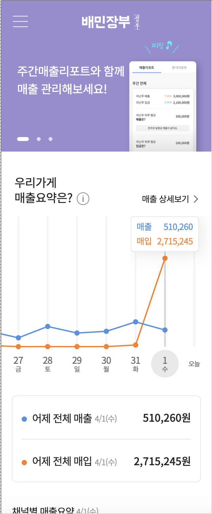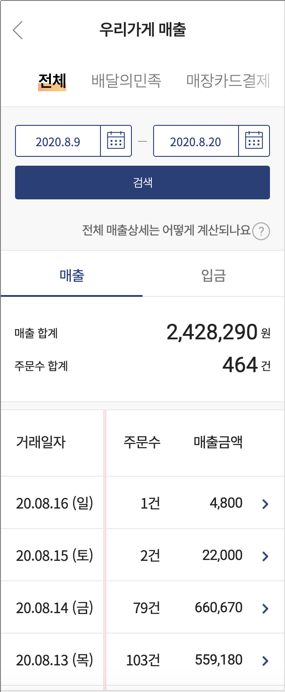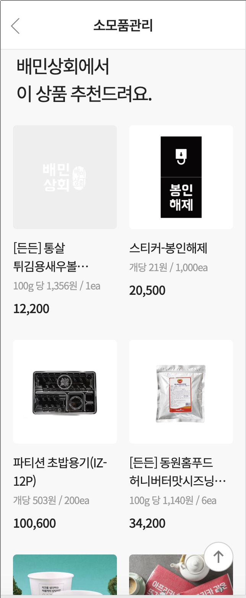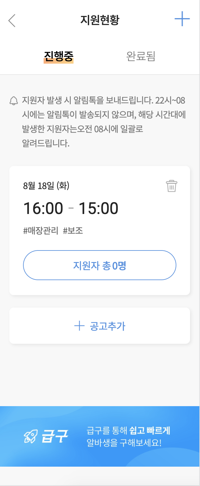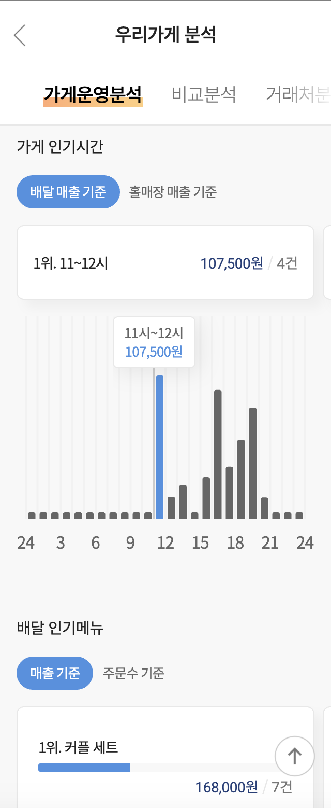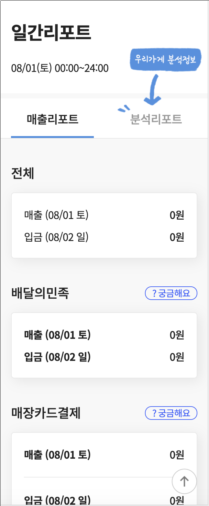

---
## 프로젝트 소개

```markdown
# Node Express

# ECMAScript 6+

# React

# Redux Saga

# Redux

# HTML5

# SCSS
```
---


<style scoped>
    section {
        text-align: center
    }
    h2 {
        margin-top: 21%;
        font-size: 100px
    } 
</style>
## 오늘 하고 싶은 이야기

---

## 리덕스, 그리고 클래스 인스턴스

배민장부의 리덕스 상태 저장소에는 클래스 인스턴스가 저장되어 있다

```markdown
# 왜 인스턴스를 저장하게 되었나?

# 어떤 방식으로 사용하고 있나?

# 어떤 이점이 있는가?

# 어떤 단점이 있는가?
```
 
---

<style scoped>
img {
    width: 48%;
    height: 300px;
    margin-right: 1%;
    background-color: #fff;
}
</style>
## Redux란?

- 중앙 상태 관리 저장소

- 복잡한 Component의 트리에 관계 없이 변경된 상태를 반영

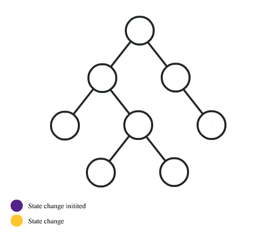 

--- 
## Redux의 원칙들 

```markdown
# Single source of truth
모든 상태는 하나의 스토어 안에 하나의 객체 트리 구조로 저장

# State is read-only
상태를 변화시키려면 액션 객체를 전달

# Changes are made with pure functions
리듀서는 외부의 상태를 변경하지 않으면서 동일한 입력값에는 동일한 결과값을 반환하는 순수 함수로 작성
```
---

<style scoped>
img {
    width: 100%;
    height: 150px;
    margin-right: 1%;
    background-color: #fff;
}
</style>

## 회원가입 예제

```markdown
# ID를 입력받는다. (영어, 숫자 15글자) 

# 이름을 입력 받는다. (영어, 한글 10글자) 

# 회원가입 버튼을 클릭 하여 가입. (Valid: *파란색*, Invalid: *빨간색*)

# 입력 받은 데이터를 store에 저장 후 서버로 전송
```

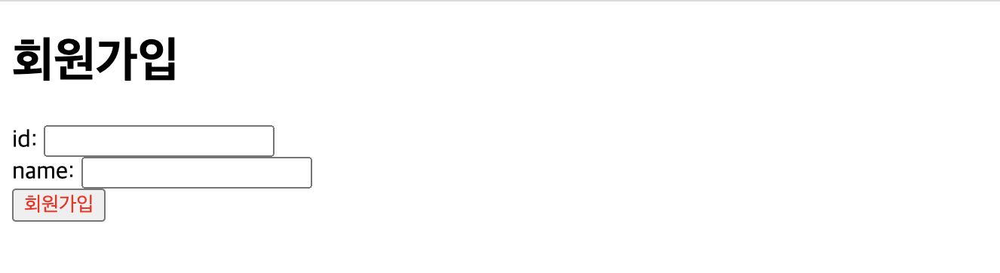

---
## Redux State, Reducer

```javascript
const INITIAL_STATE = {
  id: '',
  name: ''
}

const REDUCER = {
  updateId (state, action) {...},
  updateName (state, action) {...}
}
```

---
## App.jsx

```javascript
const Old = class extends React.PureComponent {
  render () {
    return (
      <>
        <h1>회원가입</h1>
        <Id/>
        <Name/>
        <Submit/>
      </>
    )
  }
}
```
---

## Id.jsx

아이디 입력시 리듀서 호출

```javascript
const Id = class extends React.PureComponent {
  render () {
    const {id} = this.props
    return (
        <div>
          <span>id: </span>
          <input value={id} onChange={this.#onChange}/>
        </div>
    )
  }
  ...
}
```
---

## 아이디 입력 (영어, 숫자 15글자)
 
```javascript
const REDUCER = {
  updateId (state, action) {
    const input = action.payload
    if (state.id === input) {
      return state
    }
    if (!/^[0-9a-zA-Z]{0,15}$/.test(input)) {
      return state
    }
    return {
      ...state,
      id: input
    }
  },
  ...
}
```
---

## Name.jsx

이름 입력시 리듀서 호출 

```javascript
const Name = class extends React.PureComponent {
  render () {
    const {name} = this.props
    return (
      <div>
        <span>name: </span>
        <input value={name} onChange={this.#onChange}/>
      </div>
    )
  }
  ...
}
```
---

## 이름 입력 (영어, 한글 10글자) 
 
```javascript
const REDUCER = {
  ...
  updateName (state, action) {
      const input = action.payload
      if (state.name === input) {
        return state
      }
      if (!/^[ㄱ-ㅎㅏ-ㅣ가-힣a-zA-Z]{0,10}$/.test(input)) {
        return state
      }
      return {
        ...state,
        name: input
      }
    }
}
```
---

## Submit.jsx

버튼 클릭시 사가 호출

```javascript
const Submit = class extends React.PureComponent {
  ...
  render () {
    const {id, name} = this.props
    const color = this.#getColor(id, name)
    return <button style={{color}} onClick={this.#onClick}>회원가입</button>
  }
  ...
}
```
---

## 버튼의 색상을 표현 

```javascript
const Submit = class extends React.PureComponent {
  ...
  #getColor (id, name) {
    if (this.#isIdValidated(id) && this.#isNameValidated(name)) {
      return Submit.#COLOR_OF_BLUE
    }
    return Submit.#COLOR_OF_RED
  }
  ...
}
```
---

## 입력 필드들의 유효성 확인 

```javascript
const Submit = class extends React.PureComponent {
  ...
  #isIdValidated (id) {
    return id && /^[0-9a-zA-Z]{0,15}$/.test(id)
  }
  
  #isNameValidated (name) {
    return name && /^[ㄱ-ㅎㅏ-ㅣ가-힣a-zA-Z]{0,10}$/.test(name)
  }
  ...
}
```

---

## Redux Saga

회원가입 요청

```javascript
function * apply () {
  const id = yield select(state => state.old.id)
  const name = yield select(state => state.old.name)
  if (!(id && /^[0-9a-zA-Z]{0,15}$/.test(id))) {
    return
  }
  if (!name && /^[ㄱ-ㅎㅏ-ㅣ가-힣a-zA-Z]{0,10}$/.test(name)) {
    return
  }
  console.log('Do applying !')
}
```
---
## 하지만

유효성 검사 로직이 중복

```markdown
# 필요해서 생겼다

# Submit Component
- 아이디, 비밀번호가 비어있는지 확인
- 아이디, 비밀번호가 정확히 입력 되었는지 확인

# Reducer
- 새로운 상태를 반환하기 위하여 사용자의 입력이 올바른지 확인

# Saga
- 서버로 요청 전 올바른 값들이 입력 되었는지 확인
```

---
<style scoped>
    section {
        text-align: center
    }
    h2 {
        margin-top: 21%;
        font-size: 100px
    } 
</style>
## 중복 제거
--- 
## util/Validator.js

중복 로직을 함수로 분리

```javascript
const ID_REG_EXP = /^[0-9a-zA-Z]{0,15}$/
const NAME_REG_EXP = /^[ㄱ-ㅎㅏ-ㅣ가-힣a-zA-Z]{0,10}$/

const isNotEmpty = input => !!input
export const isIdValidated = id => ID_REG_EXP.test(id)
export const isNameValidated = name => NAME_REG_EXP.test(name)
export const canIdSubmit = id => isNotEmpty(id) && isIdValidated(id)
export const canNameSubmit = name => isNotEmpty(name) && isNameValidated(name)
```
---
## 아이디 Reducer 
 
```javascript
const REDUCER = {
  updateId (state, action) {
    const input = action.payload
    if (state.id === input) {
      return state
    }
    if (!isIdValidated(input)) {
      return state
    }
    return {
      ...state,
      id: input
    }
  },
  ...
}
```
---
## 이름 Reducer 
```javascript
const REDUCER = {
  ...
  updateName (state, action) {
      const input = action.payload
      if (state.name === input) {
        return state
      }
      if (!isNameValidated(input)) {
        return state
      }
      return {
        ...state,
        name: input
      }
    }
}
```
---

## Submit.jsx

Submit에 함수 적용

```javascript
const Submit = class extends React.PureComponent {
  ...
  #getColor (id, name) {
    if (canIdSubmit(id) && canNameSubmit(name)) {
      return Submit.#COLOR_OF_BLUE
    }
    return Submit.#COLOR_OF_RED
  }
  ...
}
```
---
## Redux Saga

Redux Saga 함수 적용

```javascript
function * apply () {
  const id = yield select(state => state.old.id)
  const name = yield select(state => state.old.name)
  if (!(canIdSubmit(id) && canNameSubmit(name))) {
    return
  }
  console.log('Do applying !')
}
```
---
## 그래서 

```markdown
# 중복된 유효성 검증 코드들을 함수 하나로 모을 수 있었다. 
- React Component
- Redux Saga
- Reducer

# 이제 우리의 비지니스 로직이 변경 되면?
- util/Validator.js 만 수정하면 모든 곳에 반영 된다.

# 하나의 변경사항에 하나의 파일만 수정 해야하는 이유?
- 프로그램은 100%의 확률로 변한다.
- 많은 변경이 발생하면 테스트 해야 하는 곳도 많아 진다.
- 하나의 목적에 다수의 파일이 수정되면 변경의 여파는 점점 커지게 된다.
- 실수로 하나라도 놓친다면 버그가 발생하게 되고, 서비스의 신뢰도는 지속적으로 무너진다.
```
---
## 그런데

```markdown
# Validator.js는 정말 유틸리티인가?

# React Component가 비지니스 로직을 갖는게 맞나?

# 하나의 이유로 수정을 해야할 때, 가급적 한 파일만 고칠 수는 없을까?

# 함수는 만들고 열어두면 다른 곳에서도 사용되고 변조될 수 있지 않나?

# 상태와 함수를 하나로 만들 수 없을까?
``` 
---
<style scoped>
img {
    width: 48%;
    height: 250px;
    margin-right: 1%;
    background-color: #fff;
}
</style>

## 그래서 클래스

```markdown
# 저장소에 상태와 책임과 역할을 가지고 있는 클래스 인스턴스를 저장한다.

# 인스턴스는 자신의 역할에 따라 상태를 관리하고 책임을 수행한다.

# Application의 모든 곳에서 상태저장소에 저장된 인스턴스에게 물어보고 문제를 해결한다.
```
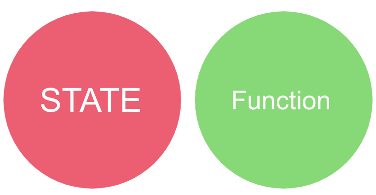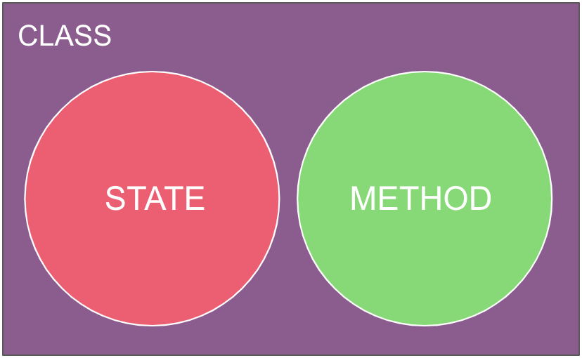

---

## State.js

Store 에 저장될 State 작성

```javascript
const State = class {
  ...  
  #id
  #name
  ...
  constructor (PRIVATE, id, name) {
    ...
    this.#id = Assertion.assertInstanceOf(id, Id)
    this.#name = Assertion.assertInstanceOf(name, Name)
    ...
  }
}
```

--- 

## Input.js

입력에 대한 추상 클래스 작성

```javascript
const Input = class {
  #input
  constructor (input) {
    this.#input = Assertion.assertString(input)
  }
  #isNotEmpty () {
    return !!this.#input
  }
  getValue () {
    return this.#input
  }
}
```
---

## Input.js

공통적으로 진행할 유효성 검사 로직 추가

```javascript
const Input = class {
  ...
  isValidated () {
    return this.#isNotEmpty() && this._isValidated(this.#input)
  }
  // Template method
  _isValidated (input) {
    Assertion.assertOverride()
  }
  ...
}
```
---

## Id.js

Id 모델 생성 및 template method 구현

```javascript
const Id = class extends Input {
  static #REG_EXP = /^[0-9a-zA-Z]{0,15}$/
  ...
  _isValidated (id) {
    return Id.#REG_EXP.test(id)
  }
}
```
---

## Name.js

Name 모델 생성 및 template method 구현

```javascript
const Name = class extends Input {
  static #REG_EXP = /^[ㄱ-ㅎㅏ-ㅣ가-힣a-zA-Z]{0,10}$/
  ...
  _isValidated (name) {
    return Name.#REG_EXP.test(name)
  }
}
```
---

## Reducer에 초기 State 생성

```javascript
const INITIAL_STATE = State.new()

const REDUCER = {
  updateId (state, action) {...},
  updateName (state, action) {...}
}
```

---

## 아이디, 이름 업데이트

State에게 업데이트 위임

```javascript
const REDUCER = {
  updateId (state, action) {
    return state.updateId(action.payload)
  },
  
  updateName (state, action) {
    return state.updateName(action.payload)
  }
}
```
---

## State.js

```javascript
const State = class {
  ...  
  updateId (input) {
    const id = this.#id
    if (id.canNotUpdate(input)) {
      return this
    }
    return this.#copy().setId(Id.from(input))
  }
  #copy () {
    return State.#of(this.#id, this.#name)
  }
  ...
}
```
---
## State.js

```javascript
const State = class {
  ...  
  updateName (input) {
    const name = this.#name
    if (name.canNotUpdate(input)) {
      return this
    }
    return this.#copy().setName(Name.from(input))
  }
  ...
}
```
---

## State.js

협력하고 있는 객체들에게 물어볼 수 있게 된다

```javascript
const State = class {
  ...  
  isValidated () {
    return this.#id.isValidated()
      && this.#name.isValidated()
  }
  ...
}
```
---

## Submit.jsx

```javascript
const Submit = class extends React.PureComponent {
  ...
  #getColor (state) {
    if (state.isValidated()) {
      return Submit.#COLOR_OF_BLUE
    }
    return Submit.#COLOR_OF_RED
  }
  ...
}
```
___ 

## Redux Saga

```javascript
function * apply () {
  const state = yield select(state => state.newOne)
  if (!state.isValidated()) {
    return
  }
  console.log('Do applying !')
}
```
---

## 새로운 입력값이 추가 되면?

추가되는 곳만 작업하면 된다.

```javascript
const State = class {
  ...  
  isValidated () {
    return this.#id.isValidated()
      && this.#name.isValidated()
      && this.#accountNumber.isValidated()
  }
  ...
}
```
---

## Redux Debugger

```markdown
# 근데 객체 인스턴스를 저장하면 private field 때문에 Redux Debugger에서 못 보잖아?

# 그럼 Memento Pattern으로 직렬화 할 수 있게 하자.
```
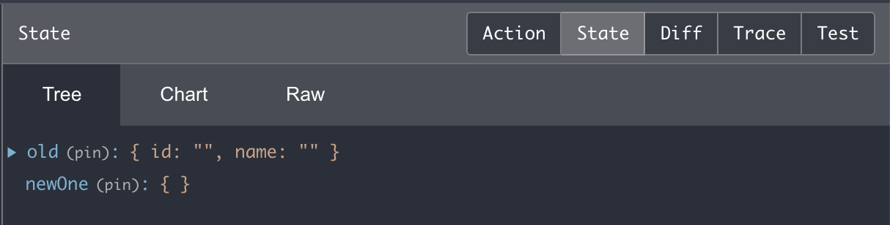

---
## State.js
```javascript
const State = class {
  ...  
  toJSON () {
    return {
      id: this.#id,
      name: this.#name
    }
  }
  ...
}
```
---

## Input.js
```javascript
const Input = class {
  ...  
  toJSON () {
    return {
      value: this.#input
    }
  }
  ...
}
```
---

## Redux Debugger

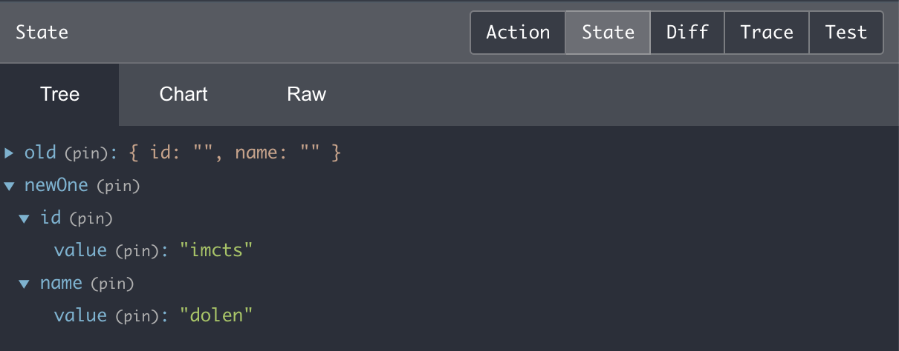

---

<style scoped>
    section {
        text-align: center
    }
    h2 {
        margin-top: 21%;
        font-size: 100px
    } 
</style>
## 시연

---

## 결과적으로 

```markdown
# 객체에게 역할과, 책임과 상태를 위임하였다
- 비지니스 로직이 한군데 모이는 캡슐화를 달성
- 내부 상태는 은닉화
- 객체는 외부에서 수정될 수 없도록 작성 되었다
- 중복 코드가 사라지는 이점을 얻을 수 있다 
- 리듀서의 객체를 복사하는 코드가 한 군데로 모이게 된다

# 리덕스의 원칙들을 위반하지 않았다
- 모든 상태는 하나의 스토어 안에 하나의 객체 트리 구조로 저장
- 상태를 변화시키려면 액션 객체를 전달
- 리듀서는 외부의 상태를 변경하지 않으면서 동일한 입력값에는 동일한 결과값을 반환하는 순수 함수로 작성

# redux-debugger의 동작 확인
```
---

## 조금 더 생각해 볼 점

```markdown
# 객체 지향과 역할 모델

# 프로젝트의 학습곡선

# 커뮤니케이션 비용 증가
```
---
# 끗
[배민장부 서비스 소개](https://wiki.woowa.in/pages/viewpage.action?pageId=71428981)
[시연코드](https://github.com/imcts/redux-class)
[React.js](https://ko.reactjs.org/)
[ReduxSaga.js](https://redux-saga.js.org/)
[Redux.js](https://redux-saga.js.org/)
[참조글](https://medium.com/@wooder2050/%EB%A6%AC%EB%8D%95%EC%8A%A4-redux-%EB%8A%94-%EC%99%9C-%EC%93%B0%EB%8A%94-%EA%B1%B4%EB%8D%B0-2eaafce30f27)
---
