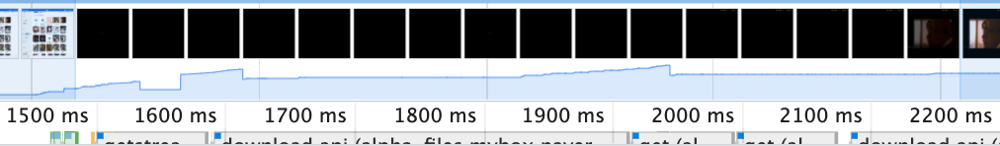
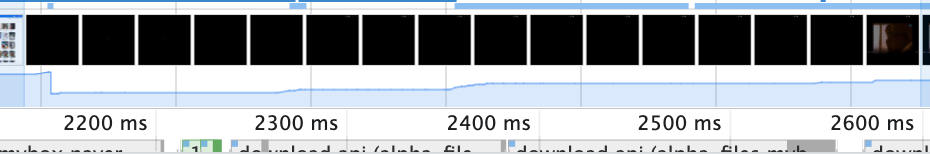

<style>
    h2 {
        font-size: 45px;
    }
</style>
<style scoped>
    h1 {
        font-size: 100px
    }
</style>

# 미디어 뷰어


---
## 목차
- 미디어뷰어
- 문제점
- 리팩토링 
- 성능개선
- 시연
- 마무리


---
<style scoped>
    section {
        text-align: center
    }
    h2 {
        margin-top: 21%;
        font-size: 100px
    } 
</style>
## 마이박스 뷰어


---
<style scoped>
p {
    text-align: center;
}
p > img {
    width: 95%;
    height: auto;
    vertical-align: top;
    margin-top: -15px;
}
</style>
## 문서뷰어


---
<style scoped>
p {
    text-align: center;
}
p > img {
    width: 95%;
    height: auto;
    vertical-align: top;
    margin-top: -15px;
}
</style>
## PSD뷰어


---
<style scoped>
p {
    text-align: center;
}
p > img {
    width: 95%;
    height: auto;
    vertical-align: top;
    margin-top: -15px;
}
</style>
## PDF뷰어


---
<style scoped>
p {
    text-align: center;
}
p > img {
    width: 95%;
    height: auto;
    vertical-align: top;
    margin-top: -15px;
}
</style>
## 미디어뷰어


---
<style scoped>
p {
    text-align: center;
}
p > img {
    width: 95%;
    height: auto;
    vertical-align: top;
    margin-top: -15px;
}
</style>
## 미디어뷰어 열기


---
<style scoped>
    section {
        text-align: center
    }
    h2 {
        margin-top: 21%;
        font-size: 100px
    } 
</style>
## 문제점

---
## 복잡해지는 미디어뷰어

```markdown
# 헤더에 추가되는 신규 과업의 증가

# 스펙에 따라 컨트롤해야 하는 각 과업별 의존도 증가

# 컨텐츠의 타입에 따라 과업 노출 조건의 복잡도 증가

# 콘텐츠의 상세 영역의 정보 증가
```


---
<style scoped>
p {
    text-align: center;
}
p > img {
    width: 95%;
    height: auto;
    vertical-align: top;
    margin-top: -15px;
}
</style>
## 수 많은 페이지에서 접근


---
## 페이지가 많은 것 무엇이 문제인가?

```markdown
# 정렬 및 검색 조건등이 페이지 별로 다름

# 페이지 별로 표현할 컨텐츠 목록이 다름

# 드라이브 API와 포토 API를 사용

# 옵셔널한 값을 미디어뷰어에 주입
```

---
<style scoped>
p {
    text-align: center;
}
p > img {
    width: 95%;
    height: auto;
    vertical-align: top;
    margin-top: 15px;
}
</style>
## 옵셔널한 데이터


---
## 옵셔널한 데이터

```markdown
# 데이터 타입 추론 불가

# 미디어뷰어에서 값을 확인하는 복잡한 조건문 중첩

# 새로운 페이지에 미디어뷰어 적용 시 조건문을 전부 분석

# 개발 비용 증가
```

---
<style scoped>
p {
    text-align: center;
}
p > img {
    width: 95%;
    height: auto;
    vertical-align: top;
    margin-top: 15px;
}
</style>
## 과업 후 페이지 갱신


---
## 의존성 증가

```markdown
# 어떤 페이지에서 호출 할지 알 수 없음

# 호출한 페이지의 정보 저장

# 페이지 의존성 증가

# 페이지 별 사이드 이펙트 발생

# 컨텐츠 변경 시 페이지 리프레시

# 초기화 코드 실행

# 성능 저하
```


---
## 중복 코드

```markdown
# 마이박스, 미니포토, 공유URL

# 제공하는 헤더 과업의 종류가 다름

# 미디어뷰어, 헤더 기능 중복하여 작성
```


---
<style scoped>
    section {
        text-align: center
    }
    h2 {
        margin-top: 21%;
        font-size: 100px
    } 
</style>
## 리팩토링


---
<style scoped>
p {
    text-align: center;
}
p > img {
    width: 95%;
    height: auto;
    vertical-align: top;
    margin-top: -15px;
}
</style>
## 공통 미디어 뷰어


---
<style scoped>
p {
    text-align: center;
}
p > img {
    width: 95%;
    height: auto;
    vertical-align: top;
    margin-top: 15px;
}
</style>
## 선택해서 사용


```markdown
# 페이지에서 사용할 과업 선택

# 프로젝트 별 과업에 대한 중복 코드 제거
```


---
<style scoped>
p {
    text-align: center;
}
p > img {
    width: 95%;
    height: auto;
    vertical-align: top;
    margin-top: -15px;
}
</style>
## 다른 부분은 컨텐츠 목록


---
<style scoped>
p {
    text-align: center;
}
p > img {
    width: 95%;
    height: auto;
    vertical-align: top;
    margin-top: 15px;
}
</style>
## 데이터 타입 추상화


```markdown
# 컨텐츠 데이터 타입 추상화

# 미디어뷰어가 컨텐츠 목록을 반환하는 인터페이스에 의존

# 페이지별로 인터페이스 구현

# 확장에 유연한 구조로 변경

# 새로운 페이지에 적용 시 개발 비용 감소
```


---
<style scoped>
p {
    text-align: center;
}
p > img {
    width: 95%;
    height: auto;
    vertical-align: top;
    margin-top: 15px;
}
</style>
## 페이지에 대한 의존성 제거


```markdown
# 페이지가 미디어뷰어를 실행 시 구독

# 미디어뷰어 과업 완료 시 이벤트 전파

# 페이지 자체적으로 전파된 이벤트에 따라 동작

# 미디어뷰어의 페이지 의존성 제거

# 미디어뷰어 수정 시 발생하는 페이지의 사이드 이펙트 제거
```


---
## 공통 미디어뷰어

```markdown
# 변하지 않는 과업은 모듈화 하여 내장

# 변하는 데이터들은 사용하는 쪽에서 주입

# 뷰어 과업 완료 시 이벤트 전파

# 높은 응집도 낮은 의존성

# 미디어뷰어 확장이나 변경에 유리하도록 구조 변경
```


---
<style scoped>
    section {
        text-align: center
    }
    h2 {
        margin-top: 21%;
        font-size: 100px
    } 
</style>
## 성능개선


---
<style scoped>
p {
    text-align: center;
}
p > img {
    width: 45%;
    height: auto;
    vertical-align: top;
    margin-top: -15px;
}
</style>
## 사진
 

 


---
<style scoped>
p {
    text-align: center;
}
p > img {
    width: 45%;
    height: auto;
    vertical-align: top;
    margin-top: -15px;
}
</style>
## 음악
 

 


---
<style scoped>
p {
    text-align: center;
}
p > img {
    width: 45%;
    height: auto;
    vertical-align: top;
    margin-top: -15px;
}
</style>
## 비디오
 

 


---
<style scoped>
    section {
        text-align: center
    }
    h2 {
        margin-top: 21%;
        font-size: 100px
    } 
</style>
## 시연


---
## 마무리

```markdown
# 문서화

# 테스트 케이스 작성 

# 컨텐츠 영역 성능 개선 
```

---
<style scoped>
    section {
        text-align: center
    }
    h2 {
        margin-top: 21%;
        font-size: 100px
    } 
</style>
## 끗
