<style>
    h2 {
        font-size: 45px;
    }
</style>
<style scoped>
    h1 {
        font-size: 100px
    }
</style>

# 뉴 드라이브


---
## 목차
- 뉴 드라이브 설명
- 문제점
- 리소스
- 시연
- 마무리
---

<style scoped>
    section {
        text-align: center
    }
    h2 {
        margin-top: 21%;
        font-size: 100px
    } 
</style>
## 뉴 드라이브 설명

---

<style scoped>
p {
    text-align: center;
}
p > img {
    width: 60%;
    height: auto;
    vertical-align: top;
    margin-top: -15px;
}
</style>
## 변경 예정안
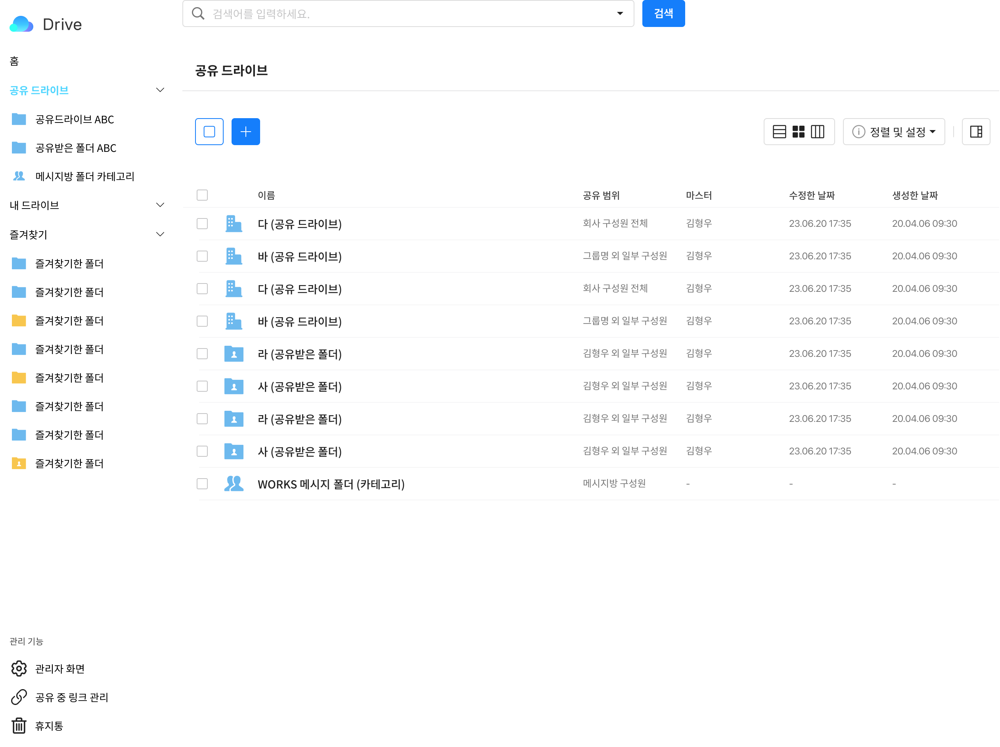


---
<style scoped>
    section {
        text-align: center
    }
    h2 {
        margin-top: 21%;
        font-size: 100px
    } 
</style>
## 문제점

---
<style scoped>
p {
    text-align: center;
}
p > img {
    width: 60%;
    height: auto;
    vertical-align: top;
    margin-top: -15px;
}
</style>
## 마이박스 화면 구성
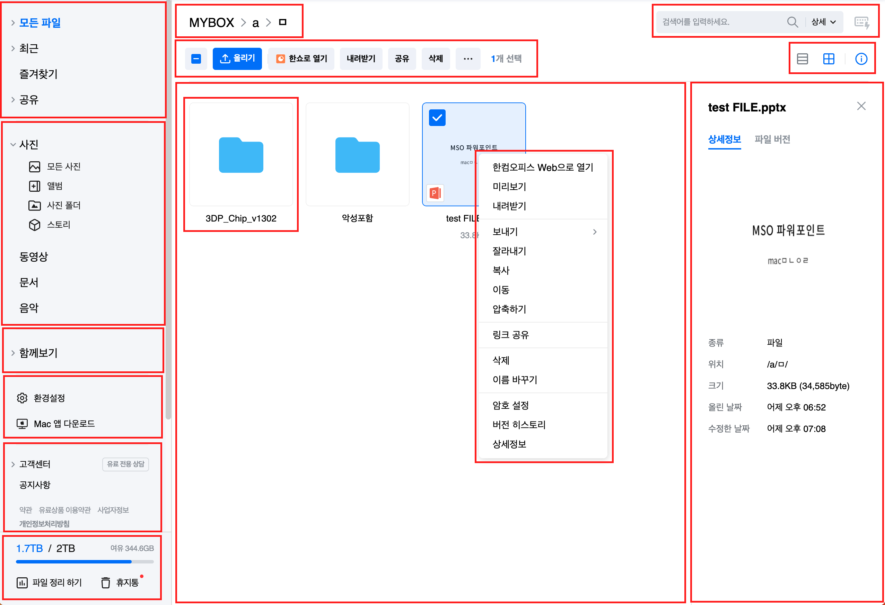

---
<style scoped>
p {
    text-align: center;
}
p > img {
    width: 60%;
    height: auto;
    vertical-align: top;
    margin-top: -15px;
}
</style>
## 문제점
```markdown
# 프로젝트가 값 기반으로 작성

# 여러군데 저장소에 중복된 데이터를 저장

# 키로 저장소마다 동기화하여 화면을 구성

# 피쳐가 증가할 때마다, 동기화해야하는 저장소가 증가

# 복잡도가 계속 증가

# 개발 시간 증가, 유지보수성 감소
```

---
<style scoped>
    section {
        text-align: center
    }
    h2 {
        margin-top: 21%;
        font-size: 100px
    } 
</style>
## 리소스

---
<style scoped>
p {
    text-align: center;
}
p > img {
    width: 60%;
    height: auto;
    vertical-align: top;
    margin-top: -15px;
}
</style>
## LNB 에서 선택된 리소스
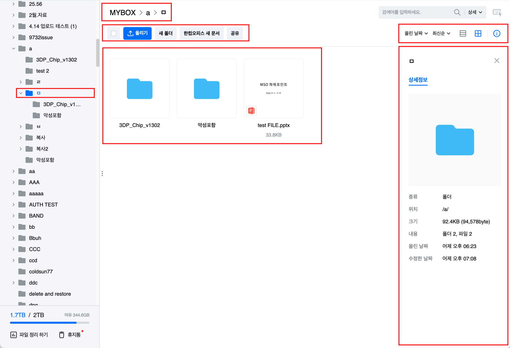

---
<style scoped>
p {
    text-align: center;
}
p > img {
    width: 60%;
    height: auto;
    vertical-align: top;
    margin-top: -15px;
}
</style>
## 컨텐츠에서 폴더 선택
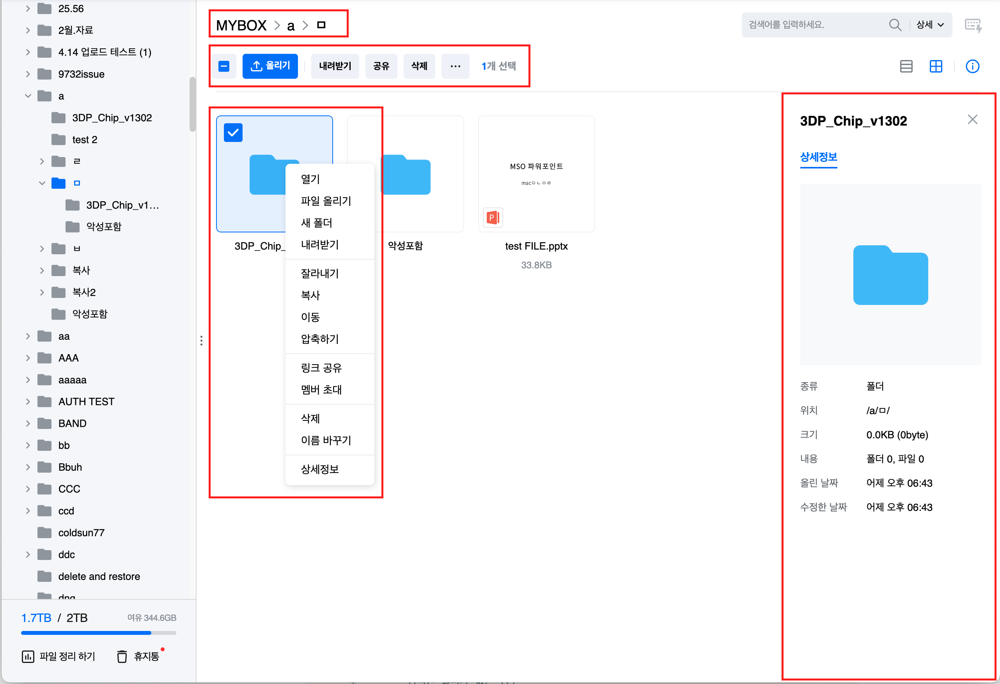

---
<style scoped>
p {
    text-align: center;
}
p > img {
    width: 60%;
    height: auto;
    vertical-align: top;
    margin-top: -15px;
}
</style>
## 컨텐츠에서 파일 선택
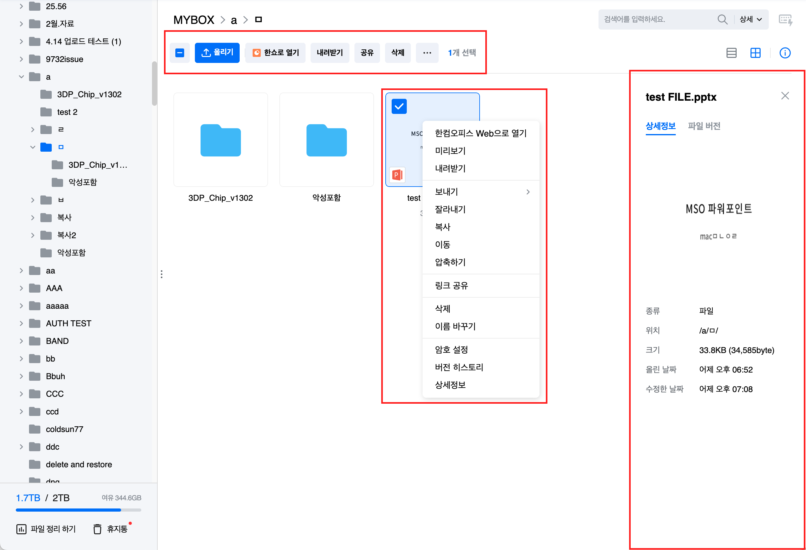

---
<style scoped>
p {
    text-align: center;
}
p > img {
    width: 60%;
    height: auto;
    vertical-align: top;
    margin-top: 0px;
}
</style>
## 정보보기 패널
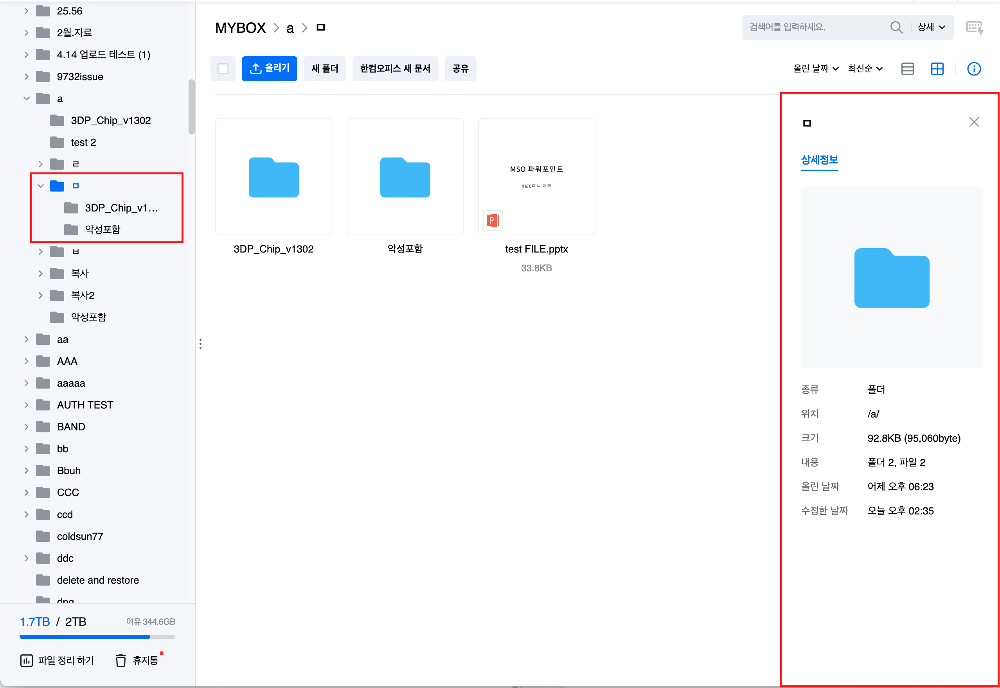

---


<style scoped>
p {
    text-align: center;
}
p > img {
    width: 60%;
    height: auto;
    vertical-align: top;
    margin-top: -15px;
}선
</style>
## 하나의 리소스
```markdown
# 응용프로그램 내부에 하나의 리소스가 저장

# 리소스 속성은 리소스가 직접 수정

# 리소스 내부 속성의 변화는 뷰에 동기화

# 뷰는 리소스의 메서드를 호출하여 화면을 구성

# 개발시간 단축, 유지보수성 증가
```

---
<style scoped>
p {
    text-align: center;
}
p > img {
    width: 60%;
    height: auto;
    vertical-align: top;
    margin-top: -15px;
}
</style>
## 고려할 점
```markdown
# 페이지 별 리소스 속성의 타입이 다르다

# 페이지 별 리소스 동작 방식이 다르다

# 리소스는 리소스를 가질 수 있다

# 리소스는 컨텐츠를 가질 수 있다

# LNB와 컨텐츠에 보여줄 리소스 목록이 다르다

# LNB와 컨텐츠의 데이터 동기화가 어렵다
```

---
<style scoped>
p {
    text-align: center;
}
p > img {
    width: 60%;
    height: auto;
    vertical-align: top;
    margin-top: 0px;
}
</style>
## 리소스 추상화
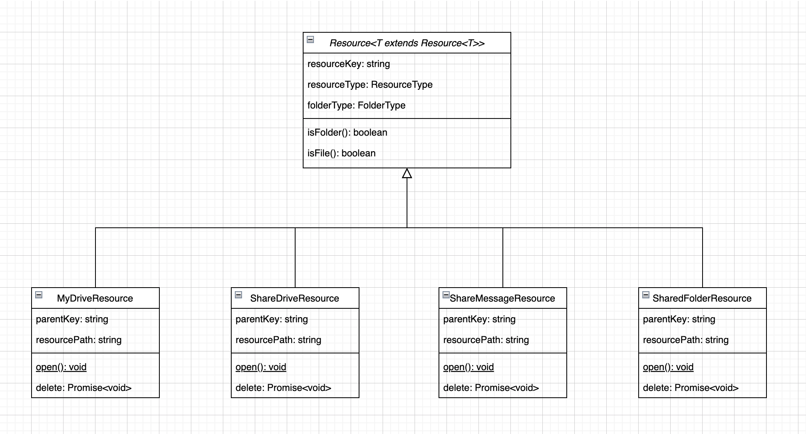

---

<style scoped>
p {
    text-align: center;
}
p > img {
    width: 60%;
    height: auto;
    vertical-align: top;
    margin-top: -15px;
}
</style>
## 리소스 구상 레이어
```markdown
# 리소스가 가지고 있는 공통점만 추상 타입에 작성

# 서로 다른 데이터 속성 저장

# 서로 다른 동작 구현
```

---
<style scoped>
p {
    text-align: center;
}
p > img {
    width: 60%;
    height: auto;
    vertical-align: top;
    margin-top: 0px;
}
</style>
## 폴더들과 컨텐츠 추상화
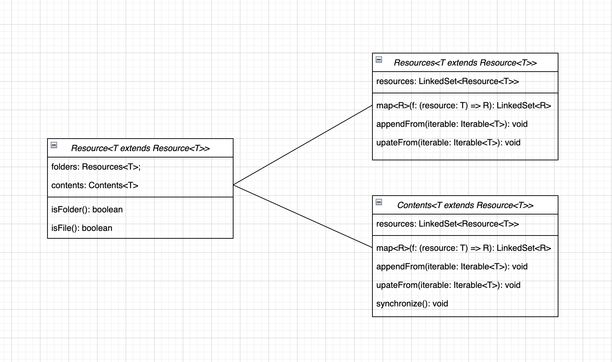

---

<style scoped>
p {
    text-align: center;
}
p > img {
    width: 60%;
    height: auto;
    vertical-align: top;
    margin-top: 0px;
}
</style>
## Resources 구상 레이어
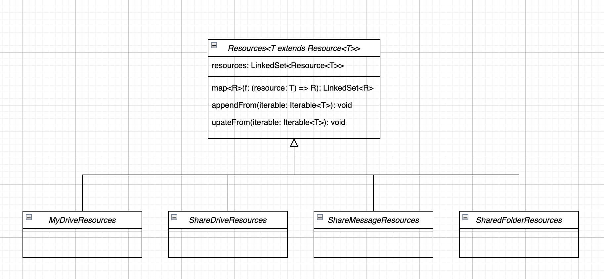

---

<style scoped>
p {
    text-align: center;
}
p > img {
    width: 60%;
    height: auto;
    vertical-align: top;
    margin-top: 0px;
}
</style>
## Contents 구상 레이어
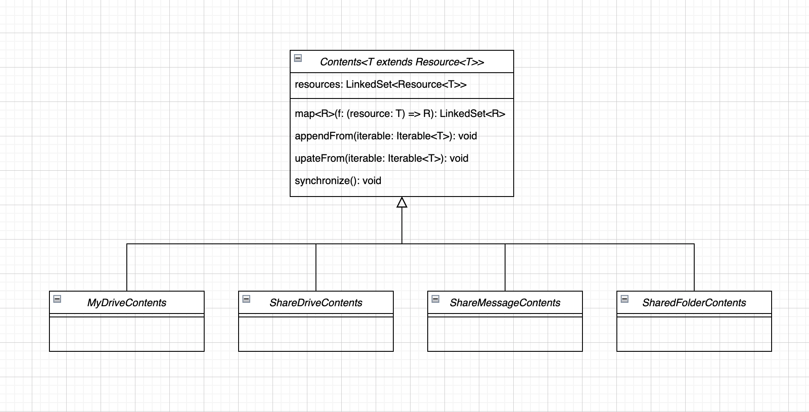

---
<style scoped>
p {
    text-align: center;
}
p > img {
    width: 60%;
    height: auto;
    vertical-align: top;
    margin-top: 0px;
}
</style>
## 내 드라이브 예시
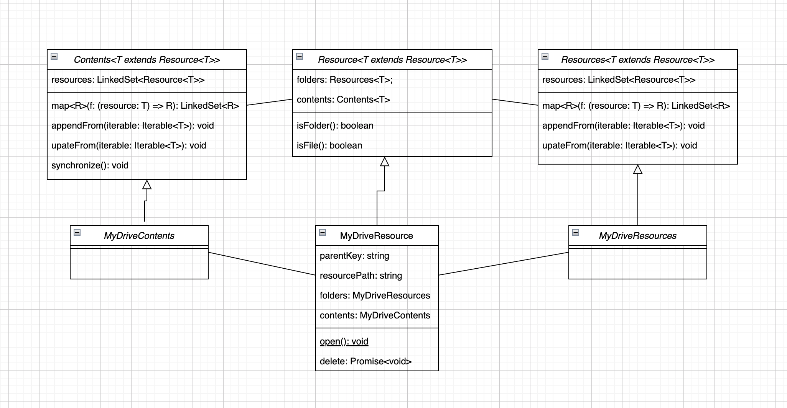

---

<style scoped>
p {
    text-align: center;
}
p > img {
    width: 60%;
    height: auto;
    vertical-align: top;
    margin-top: -15px;
}
</style>
## 자세한건 구상 레이어에서
```markdown
# 페이지 별로 다른 리소스들을 저장

# 페이지 별로 다른 컨텐츠를 저장

# 리소스는 하위 리소스들과 컨텐츠를 보유
```

---
<style scoped>
p {
    text-align: center;
}
p > img {
    width: 60%;
    height: auto;
    vertical-align: top;
    margin-top: 0px;
}
</style>
## 동기화
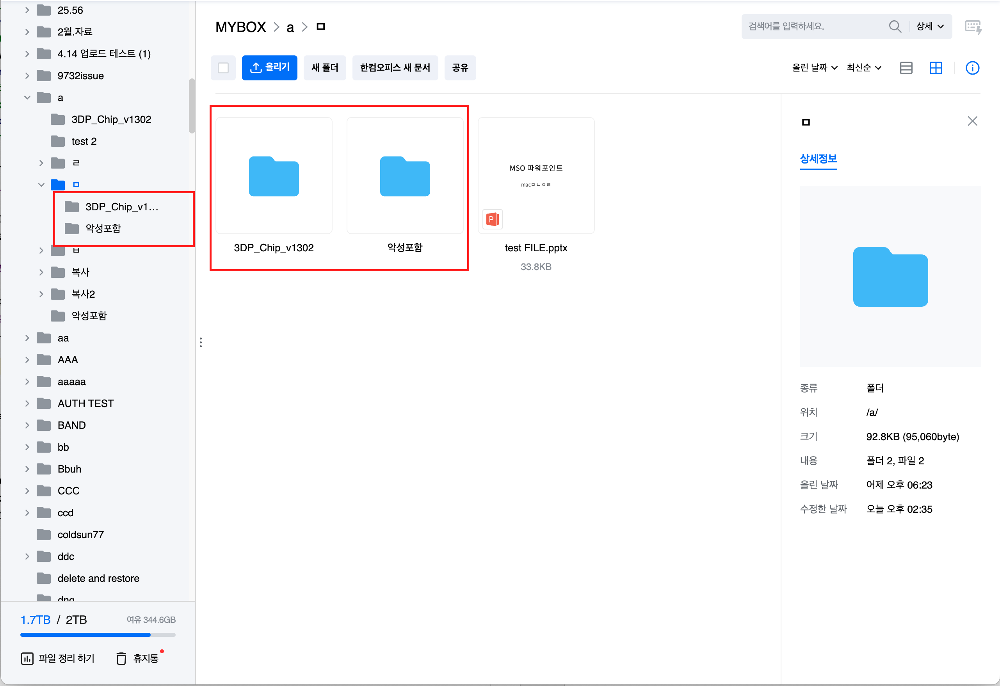

---
<style scoped>
p {
    text-align: center;
}
p > img {
    width: 60%;
    height: auto;
    vertical-align: top;
    margin-top: -15px;
}
</style>
## 자세한건 구상 레이어에서
```markdown
# 선택된 폴더의 하위 폴더를 구성하기 위해 API를 요청

# 페이지의 컨텐츠를 구성하기 위해 API를 요청

# 하위 리소스 객체를 생성하고, Resources에 저장

# 페이지 컨텐츠 객체를 생성하고, Resources에 있는 객체와 비교

# Resources에 페이지 컨텐츠와 resourceKey가 같은 객체가 있다면 해당 객체 사용

# LNB에 있는 하위 폴더 목록과, 컨텐츠의 폴더 목록이 같은 객체로 동기화
```

---
<style scoped>
p {
    text-align: center;
}
p > img {
    width: 60%;
    height: auto;
    vertical-align: top;
    margin-top: 0px;
}
</style>
## 홈, 즐겨찾기
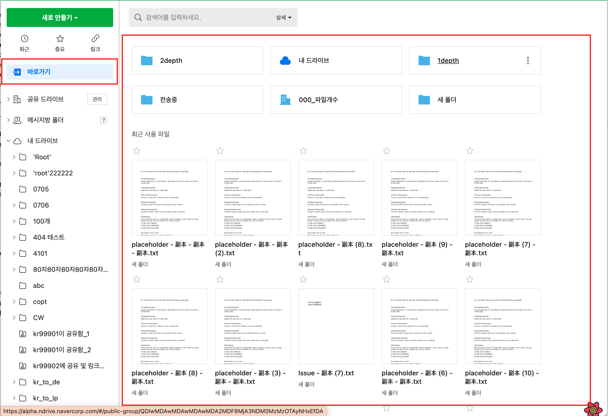

---
<style scoped>
p {
    text-align: center;
}
p > img {
    width: 60%;
    height: auto;
    vertical-align: top;
    margin-top: 0px;
}
</style>
## 메뉴, 트리 리소스로 추상화
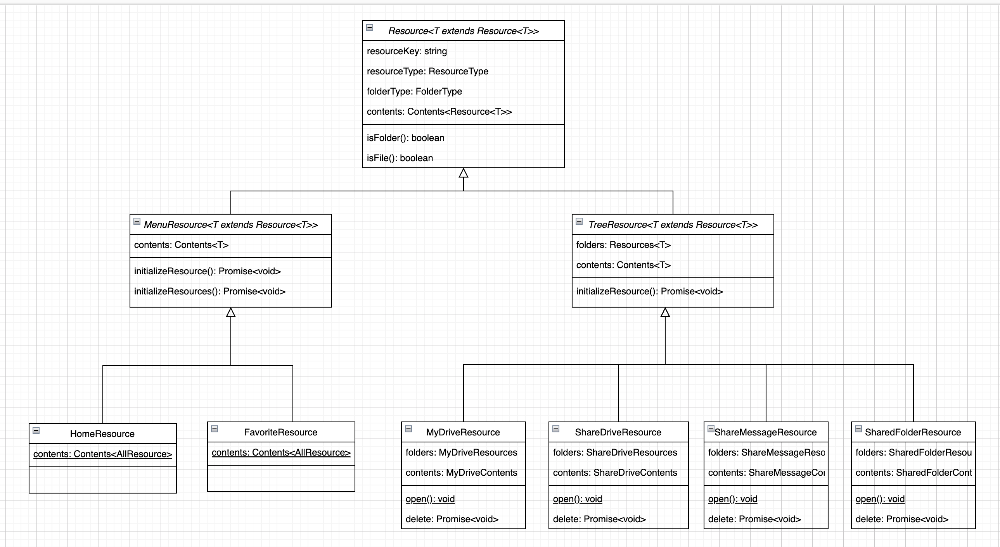


---

<style scoped>
p {
    text-align: center;
}
p > img {
    width: 60%;
    height: auto;
    vertical-align: top;
    margin-top: 0px;
}
</style>
## 팩토리에서 페이지별 리소스 생성
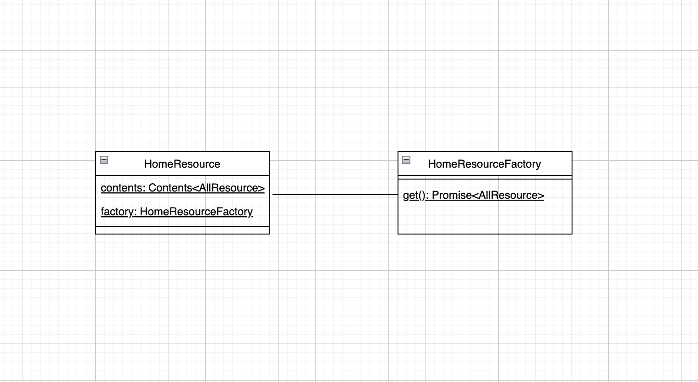

---


<style scoped>
p {
    text-align: center;
}
p > img {
    width: 60%;
    height: auto;
    vertical-align: top;
    margin-top: -15px;
}
</style>
## 추가로 고려할 점
```markdown
# 홈, 즐겨찾기에는 모든 타입의 리소스가 노출

# 홈, 즐겨찾기 컨텐츠가 로드된 이후 LNB 영역이 추가로 로드

# 홈, 즐겨찾기의 컨텐츠 리소스는 LNB영역과 실시간으로 동기화

# 홈, 즐겨찾기의 컨텐츠는 삭제 시 다시 로드
```

---
<style scoped>
p {
    text-align: center;
}
p > img {
    width: 60%;
    height: auto;
    vertical-align: top;
    margin-top: 0px;
}
</style>
## 캐시 구성


---


<style scoped>
p {
    text-align: center;
}
p > img {
    width: 60%;
    height: auto;
    vertical-align: top;
    margin-top: 0px;
}
</style>
## 리소스에 캐시 주입
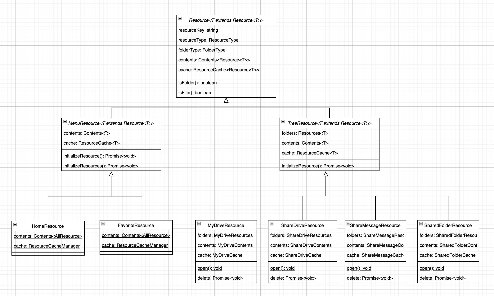

---

<style scoped>
p {
    text-align: center;
}
p > img {
    width: 60%;
    height: auto;
    vertical-align: top;
    margin-top: -15px;
}
</style>
## Resources가 캐시에 추가 삭제
```markdown
# Resources가 폴더를 추가, 삭제시 캐시에 등록 및 삭제

# 페이지별 캐시는 추가, 삭제 시 이벤트를 발생 

# ResourceCacheManager는 페이지별 캐시에서 이벤트가 발생 시 상위로 이벤트 전파

# HomeResource, FavoriteResource는 이벤트 구독

# 추가 이벤트 발생 시 컨텐츠와 동기화

# 삭제 이벤트 발생 시 페이지 리로드
```

---


<style scoped>
p {
    text-align: center;
}
p > img {
    width: 60%;
    height: auto;
    vertical-align: top;
    margin-top: 0px;
}
</style>
## 전체 구성도
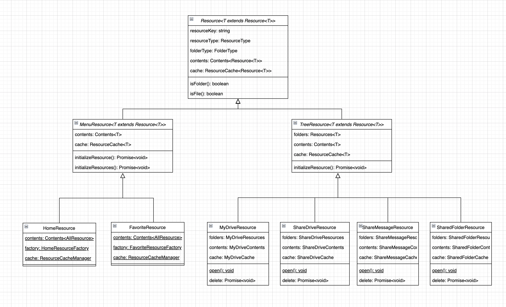

---

<style scoped>
    section {
        text-align: center
    }
    h2 {
        margin-top: 21%;
        font-size: 100px
    } 
</style>
## 시연


---
## 마무리 (1)
```javascript
  const handleDrag = () => resource.select();

  const handleMove = () => resource.move();
  
  
  ...

  class MyDriveResource {
    public async move () {
      const resources = this.selected.getSelectedResources();// 선택된 리소스관리
      await Promise.all(resources.moveTo(this));             // API 통신
      this.appendChild(resources);                           // 내 폴더에 추가
    }
  }
```
---


## 마무리 (2)

```markdown
# 값 컨텍스트가 아닌 객체 컨텍스트로 구성

# 글로벌 객체는 지양

# 선택된 컨텐츠를 보관할 역할 객체 구성

# 리소스가 커지면 역할 분배, 합성 및 위임

# 모델 별 테스트 케이스

# 디버깅 방법 고민
```

---
<style scoped>
    section {
        text-align: center
    }
    h2 {
        margin-top: 21%;
        font-size: 100px
    } 
</style>
## 끗
