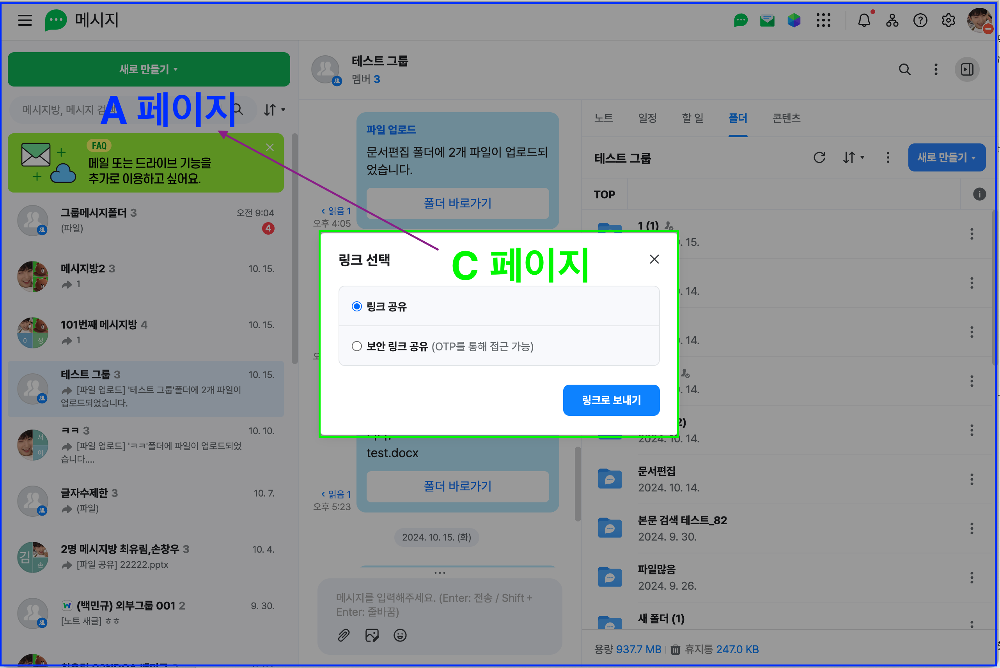

<style>
    h2 {
        font-size: 45px;
    }
</style>
<style scoped>
    h1 {
        font-size: 100px
    }
</style>

# Webtalk Drive


---
## 목차
- 요구사항
- 해결방안
- 문제점
- 라이브러리
- 해야할일
---

<style scoped>
    section {
        text-align: center
    }
    h2 {
        margin-top: 21%;
        font-size: 100px
    } 
</style>
## 요구사항

---

<style scoped>
p {
    text-align: center;
}
p > img {
    width: 860px;
    height: auto;
    vertical-align: top;
    margin-top: -25px;
    margin-bottom: 15px;
}
</style>
## 웹톡 페이지


---
<style scoped>
p {
    text-align: center;
}
p > img {
    width: 60%;
    height: auto;
    vertical-align: top;
    margin-top: -15px;
}
</style>
## 현재 상황
```markdown
# 웹톡에서 개발하는 프로젝트에 드라이브 관련된 로직이 작성되어 있음 

# 드라이브에서 요구사항이 변경되면 웹톡 FE에서 대응 필요

# 드라이브 FE가 웹톡 프로젝트에 직접 참여하여 작업하기 어려움

# 드라이브, 웹톡 프로젝트가 각각 나뉘어 있어서 서비스 요구사항 변경 시 일괄 적용이 어려움
```

---
<style scoped>
p {
    text-align: center;
}
p > img {
    width: 60%;
    height: auto;
    vertical-align: top;
    margin-top: -15px;
}
</style>
## 요구 사항
```markdown
# 웹톡 프로젝트에서 드라이브 관련 소스코드 및 의존성 제거 

# 웹톡 FE 대응 없이 드라이브 변경사항을 적용
```
---
<style scoped>
    section {
        text-align: center
    }
    h2 {
        margin-top: 21%;
        font-size: 100px
    } 
</style>
## 해결방안
---

<style scoped>
p {
    text-align: center;
}
p > img {
    width: 60%;
    height: auto;
    vertical-align: top;
    margin-top: -15px;
}
</style>
## 방법1 - 드라이브 FE가 웹톡 프로젝트를 수정
```markdown
# 서비스 요구 사항이 변경될 때마다, 드라이브와 웹톡 두 곳 모두 작업

# 웹톡과 드라이브가 사용하는 기술이 다름

# 팀의 컨벤션이나 규칙등을 전부 맞추며, 소스 코드를 수정하기가 어려움
```
---


<style scoped>
p {
    text-align: center;
}
p > img {
    width: 860px;
    height: auto;
    vertical-align: top;
    margin-top: 45px;
    margin-bottom: 15px;
}
</style>
## 방법2 - 폴더 영역 라이브러리를 제공


---
<style scoped>
p {
    text-align: center;
}
p > img {
    width: 860px;
    height: auto;
    vertical-align: top;
    margin-top: 45px;
    margin-bottom: 15px;
}
</style>
## 방법2 - 폴더 영역 라이브러리를 제공


---

<style scoped>
p {
    text-align: center;
}
p > img {
    width: 60%;
    height: auto;
    vertical-align: top;
    margin-top: -15px;
}
</style>
## 방법2 - 폴더 영역 라이브러리를 제공
```markdown
# 라이브러리 내부에 소스코드가 직접 존재

# 서비스 요구 사항이 변경될 때마다, 드라이브와 라이브러리 두 곳 모두 작업

# QA 이슈가 발생했을때, 드라이브 FE에서 라이브러리를 수정 및 배포 

# 웹톡 서비스에서 해당 라이브러리를 업데이트하여 재배포 해야만 수정 사항이 반영
```
---

<style scoped>
p {
    text-align: center;
}
p > img {
    width: 860px;
    height: auto;
    vertical-align: top;
    margin-top: -25px;
    margin-bottom: 15px;
}
</style>
## 방법3 - Iframe (Inline Frame)


---


<style scoped>
p {
    text-align: center;
}
p > img {
    width: 60%;
    height: auto;
    vertical-align: top;
    margin-top: -15px;
}
</style>
## 방법3 - Iframe (Inline Frame)
```markdown
# 드라이브 FE에서 웹톡 폴더 영역에 해당하는 페이지를 제공 

# 웹톡 페이지에서는 드라이브 FE에서 제공한 페이지를 IFrame으로 삽입 

# 드라이브 FE에서 수정 시 언제든 웹톡 페이지에 반영

# 웹톡 프로젝트에서 드라이브 의존성 제거 및 코드 삭제
```
---

<style scoped>
    section {
        text-align: center
    }
    h2 {
        margin-top: 21%;
        font-size: 100px
    } 
</style>
## 문제점
---

<style scoped>
p {
    text-align: center;
}
p > img {
    width: 860px;
    height: auto;
    vertical-align: top;
    margin-top: -25px;
    margin-bottom: 15px;
}
</style>
## 과업 수행 


---

<style scoped>
p {
    text-align: center;
}
p > img {
    width: 860px;
    height: auto;
    vertical-align: top;
    margin-top: -25px;
    margin-bottom: 15px;
}
</style>
## 과업 수행


---


<style scoped>
p {
    text-align: center;
}
p > img {
    width: 860px;
    height: auto;
    vertical-align: top;
    margin-top: -25px;
    margin-bottom: 15px;
}
</style>
## 모달 노출 범위


---

<style scoped>
p {
    text-align: center;
}
p > img {
    width: 60%;
    height: auto;
    vertical-align: top;
    margin-top: -15px;
}
</style>
## 문제점
```markdown
# 서로 다른 페이지에서는 본인의 영역이 아닌 화면에 렌더링 불가

# 그로인해 모달이 웹톡 페이지의 정중앙에 노출되게 할 수 없음

# 드라이브는 본인의 영역만 활용 가능
```
---


<style scoped>
p {
    text-align: center;
}
p > img {
    width: 860px;
    height: auto;
    vertical-align: top;
    margin-top: -25px;
    margin-bottom: 15px;
}
</style>
## 과업 수행 시 웹톡으로 요청


---


<style scoped>
p {
    text-align: center;
}
p > img {
    width: 860px;
    height: auto;
    vertical-align: top;
    margin-top: -25px;
    margin-bottom: 15px;
}
</style>
## 과업 수행 시 웹톡으로 요청 


---


<style scoped>
p {
    text-align: center;
}
p > img {
    width: 860px;
    height: auto;
    vertical-align: top;
    margin-top: -25px;
    margin-bottom: 15px;
}
</style>
## 과업 수행 시 웹톡으로 요청 


---

<style scoped>
p {
    text-align: center;
}
p > img {
    width: 60%;
    height: auto;
    vertical-align: top;
    margin-top: -15px;
}
</style>
## 문제점
```markdown
# 드라이브 페이지의 요청을 받아 웹톡에서 모달을 정중앙에 띄워 줘야 함 

# 과업에 대한 소스코드가 결국 웹톡에 작성 되어야 함

# 웹톡 프로젝트에서 드라이브 의존성을 제거 불가
```
---


<style scoped>
p {
    text-align: center;
}
p > img {
    width: 860px;
    height: auto;
    vertical-align: top;
    margin-top: -25px;
    margin-bottom: 15px;
}
</style>
## 과업을 별도의 페이지로 제공


---
<style scoped>
p {
    text-align: center;
}
p > img {
    width: 860px;
    height: auto;
    vertical-align: top;
    margin-top: -25px;
    margin-bottom: 15px;
}
</style>
## 과업을 별도의 페이지로 제공


---

<style scoped>
p {
    text-align: center;
}
p > img {
    width: 60%;
    height: auto;
    vertical-align: top;
    margin-top: -15px;
}
</style>
## 과업을 별도의 페이지로 제공
```markdown
# 위치선택 팝업처럼 과업을 별도의 페이지로 제공 가능 

# 링크 공유, 히스토리 등 웹톡에서 필요한 과업을 별도의 페이지로 작성하여 제공 

# 웹톡에서는 드라이브 폴더 영역에서 과업 요청이 오면, 과업 페이지를 호출하는 것으로 문제 해결 
```
---

<style scoped>
p {
    text-align: center;
}
p > img {
    width: 860px;
    height: auto;
    vertical-align: top;
    margin-top: -25px;
    margin-bottom: 15px;
}
</style>
## 과업을 별도의 페이지로 제공


---


<style scoped>
p {
    text-align: center;
}
p > img {
    width: 860px;
    height: auto;
    vertical-align: top;
    margin-top: -25px;
    margin-bottom: 15px;
}
</style>
## 과업을 별도의 페이지로 제공


---

<style scoped>
p {
    text-align: center;
}
p > img {
    width: 860px;
    height: auto;
    vertical-align: top;
    margin-top: -25px;
    margin-bottom: 15px;
}
</style>
## 과업을 별도의 페이지로 제공


---
<style scoped>
p {
    text-align: center;
}
p > img {
    width: 860px;
    height: auto;
    vertical-align: top;
    margin-top: -25px;
    margin-bottom: 15px;
}
</style>
## 과업을 별도의 페이지로 제공


---
<style scoped>
p {
    text-align: center;
}
p > img {
    width: 860px;
    height: auto;
    vertical-align: top;
    margin-top: -25px;
    margin-bottom: 15px;
}
</style>
## 과업을 별도의 페이지로 제공


---

<style scoped>
p {
    text-align: center;
}
p > img {
    width: 60%;
    height: auto;
    vertical-align: top;
    margin-top: -15px;
}
</style>
## 과업을 별도의 페이지로 제공
```markdown
# 드라이브 서비스에 대한 소스코드를 웹톡 프로젝트에서 제거

# 웹톡에서는 드라이브FE에서 제공한 페이지만을 호출하여 연계

# 웹톡에서 드라이브 서비스에 대한 의존성 제거
```

---

<style scoped>
    section {
        text-align: center
    }
    h2 {
        margin-top: 21%;
        font-size: 100px
    } 
</style>
## 라이브러리
---

<style scoped>
p {
    text-align: center;
}
p > img {
    width: 860px;
    height: auto;
    vertical-align: top;
    margin-top: 25px;
    margin-bottom: 15px;
}
</style>
## 웹톡의 연계 작업


---

<style scoped>
p {
    text-align: center;
}
p > img {
    width: 60%;
    height: auto;
    vertical-align: top;
    margin-top: -15px;
}
</style>
## 웹톡의 연계 작업
```markdown
# 웹톡 프로젝트 내부에서 드라이브 로직은 제거했으나, 오히려 페이지 별 연계 작업에 대한 코드가 삽입

# 웹톡 프로젝트에서 드라이브 의존성은 여전히 존재

# 추후 드라이브 서비스 요구사항이 변경되면, 웹톡 FE가 대응해야 하는 이슈는 변하지 않음
```
---

<style scoped>
p {
    text-align: center;
}
p > img {
    width: 860px;
    height: auto;
    vertical-align: top;
    margin-top: 45px;
    margin-bottom: 15px;
}
</style>
## 웹톡의 연계 작업


---


<style scoped>
p {
    text-align: center;
}
p > img {
    width: 860px;
    height: auto;
    vertical-align: top;
    margin-top: 45px;
    margin-bottom: 15px;
}
</style>
## 웹톡의 연계 작업


---


<style scoped>
p {
    text-align: center;
}
p > img {
    width: 60%;
    height: auto;
    vertical-align: top;
    margin-top: -15px;
}
</style>
## 웹톡의 연계 작업
```markdown
# 드라이브에서 제공하는 각 페이지를 연계해주는 역할을 하는 라이브러리를 작성하여 웹톡에 제공

# 웹톡 프로젝트는 드라이브가 제공한 라이브러리만 연동

# 웹톡 프로젝트에서는 드라이브에 대한 모든 의존성 및 소스코드가 제거

# 드라이브는 스펙 변경 시 제공하는 페이지만 변경하면 실시간으로 요구사항 반영 가능

# 드라이브는 소스코드를 한군데에서 전부 관리할 수 있으므로 유지보수 용이

# 추후 다른 서비스에 드라이브 서비스를 제공할 때에도 응용이 가능하므로 확장성도 좋음 
```
---


<style scoped>
    section {
        text-align: center
    }
    h2 {
        margin-top: 21%;
        font-size: 100px
    } 
</style>
## 해야할일

---


<style scoped>
p {
    text-align: center;
}
p > img {
    width: 60%;
    height: auto;
    vertical-align: top;
    margin-top: -15px;
}
</style>
## 해야할일
```markdown
# 웹톡에 제공할 페이지 연계용 라이브러리 구현 

# 웹톡에 제공할 과업들을 선별 및 삭제

# 선별된 과업들을 팝업 형태로 각각의 페이지로 제공

# 웹톡에 적용 및 테스트

# https://wiki.navercorp.com/pages/viewpage.action?pageId=2778264741
```
---


<style scoped>
    section {
        text-align: center
    }
    h2 {
        margin-top: 21%;
        font-size: 100px
    } 
</style>
## 끗
